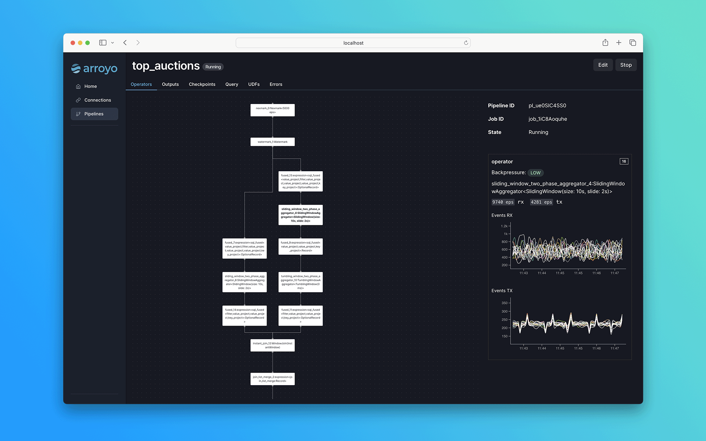

<h1 align="center">
    
</h1>


<h4 align="center">
  <a href="https://arroyo.dev/">Arroyo Cloud</a> |
  <a href="https://doc.arroyo.dev/getting-started">Getting started</a> |
  <a href="https://doc.arroyo.dev">Docs</a> |
  <a href="https://discord.gg/cjCr5rVmyR">Discord</a> |
  <a href="https://arroyo.dev">Website</a>
</h4>

<h4 align="center">
  <a href="https://github.com/ArroyoSystems/arroyo/blob/main/LICENSE-APACHE">
    
  </a>
  <a href="https://github.com/ArroyoSystems/arroyo/blob/main/CONTRIBUTING.md">
    
  </a>
  <a href="https://github.com/Infisical/infisical/issues">
    
  </a>
  
</h4>


[Arroyo](https://arroyo.dev) is a distributed stream processing engine written in Rust, designed to efficiently
perform stateful computations on streams of data. Unlike traditional batch processing, streaming engines can operate
on both bounded and unbounded sources, emitting results as soon as they are available.

In short: Arroyo lets you ask complex questions of high-volume real-time data with subsecond results.



## Features

🦀 SQL and Rust pipelines

🚀 Scales up to millions of events per second

🪟 Stateful operations like windows and joins

🔥State checkpointing for fault-tolerance and recovery of pipelines

🕒 Timely stream processing via the [Dataflow model](https://www.oreilly.com/radar/the-world-beyond-batch-streaming-101/)

## Use cases

Some example use cases include:

* Detecting fraud and security incidents
* Real-time product and business analytics
* Real-time ingestion into your data warehouse or data lake
* Real-time ML feature generation

## Why Arroyo

There are already a number of existing streaming engines out there, including [Apache Flink](https://flink.apache.org),
[Spark Streaming](https://spark.apache.org/docs/latest/streaming-programming-guide.html), and
[Kafka Streams](https://kafka.apache.org/documentation/streams/). Why create a new one?

* _Serverless operations_: Arroyo pipelines are designed to run in modern cloud environments, supporting seamless scaling,
    recovery, and rescheduling
* _High performance SQL_: SQL is a first-class concern, with consistently excellent performance
* _Designed for non-experts_: Arroyo cleanly separates the pipeline APIs from its internal implementation. You don't
    need to be a streaming expert to build real-time data pipelines.

## Current state

Arroyo is currently alpha. It is missing features and has known bugs. At this stage, it is likely to primarily be of
interest to the Rust data processing community and contributors.

## Getting Started

You can get started with a single node Arroyo cluster by running the following docker command:

```
$ docker run -p 8000:8000 -p 8001:8001 ghcr.io/arroyosystems/arroyo-single:multi-arch
```

Then, load the Web UI at http://localhost:8000.

For a more in-depth guide, see the [getting started guide](https://doc.arroyo.dev/getting-started).

Once you have Arroyo running, follow the [tutorial](https://doc.arroyo.dev/tutorial) to create your first real-time
pipeline.

## Developing Arroyo

We love contributions from the community! See the [developer setup](https://doc.arroyo.dev/developing/dev-setup) guide
to get started, and reach out to the team on [discord](https://discord.gg/cjCr5rVmyR) or create an issue.

## Community

* [Discord](https://discord.gg/cjCr5rVmyR) &mdash; support and project discussion
* [GitHub issues](https://github.com/ArroyoSystems/arroyo/issues) &mdash; bugs and feature requests
* [Arroyo Blog](https://arroyo.dev/blog) &mdash; updates from the Arroyo team

## Arroyo Cloud

Don't want to self-host? Arroyo Systems provides fully-managed cloud hosting for Arroyo. Sign up
[here](https://arroyo.dev).
