# Arroyo Architecture Diagrams

A comprehensive visual guide to how the Arroyo distributed stream processing engine works.

---

## 1. System Architecture

The overall topology of Arroyo services, their communication protocols, and external dependencies.

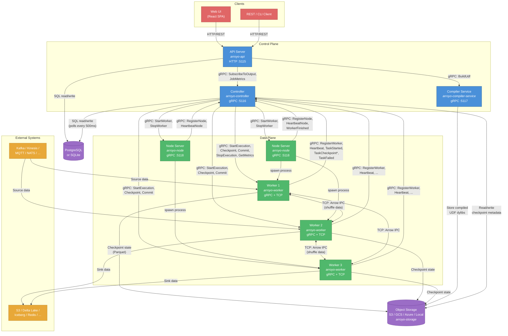

### Key Communication Patterns

| Path | Protocol | Purpose |
|------|----------|---------|
| Client -> API | HTTP/REST | Pipeline CRUD, job management, UI serving |
| API -> Controller | gRPC | Output subscription, metrics queries |
| API -> Compiler | gRPC | UDF compilation (Rust -> dylib) |
| Controller -> Worker | gRPC | Start execution, checkpoint, commit, stop |
| Worker -> Controller | gRPC | Register, heartbeat, task events, sink data |
| Controller -> Node | gRPC | Start/stop worker processes |
| Node -> Controller | gRPC | Register, heartbeat, worker exit notification |
| Worker <-> Worker | TCP | Arrow IPC data for shuffle/repartition |
| API/Controller -> DB | SQL | Job configs (desired state) and job status (current state) |
| Worker -> Object Storage | Parquet | Checkpoint state persistence |
| Compiler -> Object Storage | Binary | Compiled UDF dylib storage |

### Deployment Modes

The `arroyo` binary supports four scheduler modes:

| Mode | Command | How Workers Run |
|------|---------|-----------------|
| **Embedded** | `arroyo cluster` | In-process as Tokio tasks (single binary) |
| **Process** | API + Controller separate | Forked as child processes on same machine |
| **Node** | + Node servers | Distributed across registered Node servers |
| **Kubernetes** | K8s deployment | As Kubernetes Job resources (pods) |

---

## 2. Job Lifecycle State Machine

The Controller manages each job through a compile-time-enforced state machine defined in `crates/arroyo-controller/src/states/`.

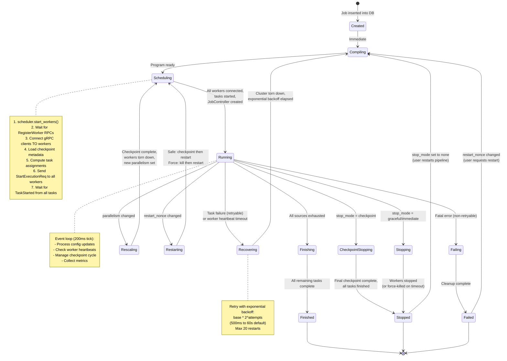

### State Descriptions

| State | File | What Happens |
|-------|------|-------------|
| **Created** | `states/mod.rs:84` | Immediate transition to Compiling |
| **Compiling** | `states/compiling.rs` | Pass-through (compilation happens at API time) |
| **Scheduling** | `states/scheduling.rs` | Start workers, wait for connections, deploy program |
| **Running** | `states/running.rs` | Main event loop: config changes, checkpoints, metrics |
| **CheckpointStopping** | `states/checkpoint_stopping.rs` | Final checkpoint with `then_stop=true` |
| **Stopping** | `states/stopping.rs` | Send StopExecution or force-kill workers |
| **Rescaling** | `states/rescaling.rs` | Checkpoint, tear down, re-schedule with new parallelism |
| **Recovering** | `states/recovering.rs` | Backoff, tear down cluster, restart from last checkpoint |
| **Restarting** | `states/restarting.rs` | User-initiated restart (safe or force) |
| **Finishing** | `states/finishing.rs` | Sources exhausted, wait for remaining tasks |
| **Failing** | `states/failing.rs` | Graceful shutdown before entering Failed |
| **Stopped** | `states/mod.rs:153` | Terminal. Awaits restart command |
| **Failed** | `states/mod.rs:112` | Terminal. Awaits restart command |
| **Finished** | `states/mod.rs:135` | Terminal. Job completed successfully |

### Error Handling

The state machine uses two error types:
- **`FatalError`** -- Immediately transitions to `Failing -> Failed`
- **`RetryableError`** -- Transitions to `Recovering`, which applies exponential backoff and retries up to `allowed_restarts` (default: 20) times

---

## 3. SQL-to-Execution Pipeline

How a SQL query is transformed into a running distributed dataflow.

```mermaid
flowchart TB
    subgraph Stage1["Stage 1: SQL Parsing"]
        SQL["SQL Text<br/><code>CREATE TABLE ... INSERT INTO ... SELECT ...</code>"]
        Parser["sqlparser-rs<br/>with ArroyoDialect"]
        AST["SQL AST<br/>(Vec&lt;Statement&gt;)"]
        SQL --> Parser --> AST
    end

    subgraph Stage2["Stage 2: Statement Classification"]
        AST --> Classify{Statement Type?}
        Classify -->|"CREATE TABLE"| DDL["Register ConnectorTable<br/>in SchemaProvider"]
        Classify -->|"CREATE VIEW"| View["Register as<br/>TableFromQuery"]
        Classify -->|"INSERT INTO"| Insert["InsertQuery<br/>(explicit sink)"]
        Classify -->|"SELECT"| Anon["Anonymous<br/>(preview sink)"]
        Classify -->|"SET"| Config["Update planner<br/>config"]
    end

    subgraph Stage3["Stage 3: DataFusion Logical Planning"]
        Insert --> SqlToRel["DataFusion<br/>SqlToRel"]
        Anon --> SqlToRel
        DDL -.->|"tables registered in<br/>ArroyoSchemaProvider"| SqlToRel
        View -.->|"views registered"| SqlToRel
        SqlToRel --> LogPlan["DataFusion<br/>LogicalPlan"]
        LogPlan --> Optimizer["DataFusion Optimizer<br/>(20+ rules: push filters,<br/>simplify exprs, eliminate<br/>joins/unions, etc.)"]
        Optimizer --> OptPlan["Optimized<br/>LogicalPlan"]
    end

    subgraph Stage4["Stage 4: Streaming Rewrite"]
        OptPlan --> Rewriter["ArroyoRewriter<br/>(TreeNodeRewriter)"]

        Rewriter --> |"TableScan"| SrcExt["TableSourceExtension<br/>+ WatermarkNode<br/>+ RemoteTableExtension"]
        Rewriter --> |"Aggregate + window fn"| AggExt["AggregateExtension<br/>(Tumbling/Sliding/Session)"]
        Rewriter --> |"Join"| JoinExt["JoinExtension<br/>+ KeyCalculationExtension"]
        Rewriter --> |"Projection"| ProjExt["ProjectionExtension<br/>(+ async UDF detection)"]

        SrcExt --> StreamPlan["Streaming<br/>LogicalPlan<br/>(with Extension nodes)"]
        AggExt --> StreamPlan
        JoinExt --> StreamPlan
        ProjExt --> StreamPlan

        StreamPlan --> SinkWrap["Wrap in SinkExtension<br/>(+ ToDebezium if CDC)"]
    end

    subgraph Stage5["Stage 5: Graph Construction"]
        SinkWrap --> Visitor["PlanToGraphVisitor<br/>(walks extension tree)"]
        Visitor --> Graph["LogicalGraph<br/>(petgraph DiGraph)"]
        Graph --> Chain["ChainingOptimizer<br/>(merge adjacent Forward<br/>nodes into OperatorChains)"]
        Chain --> OptGraph["Optimized<br/>LogicalGraph"]
    end

    subgraph Stage6["Stage 6: Serialization & Deployment"]
        OptGraph --> Proto["Serialize to<br/>ArrowProgram (protobuf)"]
        Proto --> DBStore[("Store in DB<br/>(pipeline row)")]
        DBStore --> CtrlPoll["Controller polls DB<br/>(every 500ms)"]
        CtrlPoll --> Deploy["Send StartExecutionReq<br/>to each Worker via gRPC"]
        Deploy --> Deser["Worker deserializes<br/>ArrowProgram"]
        Deser --> PhysGraph["Expand to physical graph<br/>(parallelism instances)"]
        PhysGraph --> Exec["Schedule operator tasks<br/>on Tokio runtime"]
    end

    classDef stage fill:#f0f0f0,stroke:#999
    classDef action fill:#4A90D9,stroke:#2C5F8A,color:#fff
    classDef data fill:#50B86C,stroke:#2D7A3E,color:#fff
    classDef storage fill:#9B6DC6,stroke:#6B3F96,color:#fff

    class Parser,SqlToRel,Optimizer,Rewriter,Visitor,Chain action
    class AST,LogPlan,OptPlan,StreamPlan,Graph,OptGraph,Proto data
    class DBStore,CtrlPoll storage
```

### Concrete Example

Given this SQL:
```sql
CREATE TABLE clicks (user_id TEXT, url TEXT, ts TIMESTAMP, WATERMARK FOR ts AS ts - INTERVAL '5 seconds')
  WITH (connector = 'kafka', topic = 'clicks', format = 'json');

CREATE TABLE click_counts (user_id TEXT, window_start TIMESTAMP, cnt BIGINT)
  WITH (connector = 'kafka', topic = 'click_counts', format = 'json');

INSERT INTO click_counts
  SELECT user_id, window_start, count(*) as cnt
  FROM tumble(clicks, interval '1 minute')
  GROUP BY user_id, window_start;
```

The resulting dataflow graph after all transformations:

```mermaid
graph LR
    S["ConnectorSource<br/><b>Kafka: clicks</b><br/>parallelism=4"]
    V["ArrowValue<br/><b>deserialize + project</b>"]
    WM["ExpressionWatermark<br/><b>ts - 5s</b>"]
    K["ArrowKey<br/><b>hash(user_id)</b>"]
    AGG["TumblingWindowAggregate<br/><b>tumble(1 min), count(*)</b><br/>parallelism=4"]
    P["Projection<br/><b>select output cols</b>"]
    SINK["ConnectorSink<br/><b>Kafka: click_counts</b><br/>parallelism=4"]

    S -->|"Forward"| V
    V -->|"Forward"| WM
    WM -->|"Forward"| K
    K -->|"Shuffle<br/>(hash partition<br/>by user_id)"| AGG
    AGG -->|"Forward"| P
    P -->|"Forward"| SINK

    classDef source fill:#50B86C,stroke:#2D7A3E,color:#fff
    classDef op fill:#4A90D9,stroke:#2C5F8A,color:#fff
    classDef sink fill:#E06666,stroke:#A33D3D,color:#fff

    class S source
    class V,WM,K,AGG,P op
    class SINK sink
```

After **chaining optimization**, adjacent Forward nodes with the same parallelism are merged:

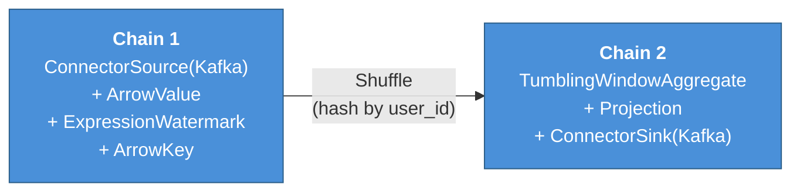

---

## 4. Data Flow Through Operators

How Arrow RecordBatches move through the system at runtime.

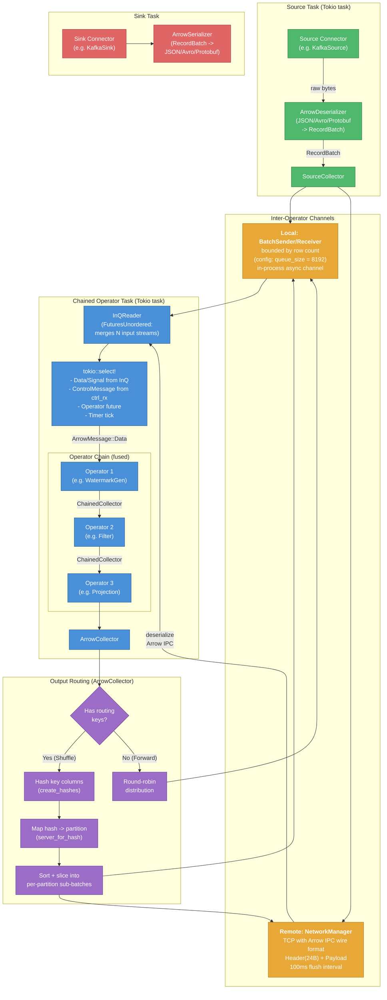

### Signal Messages (in-band with data)

Signals flow through the same channels as data, using `ArrowMessage::Signal`:

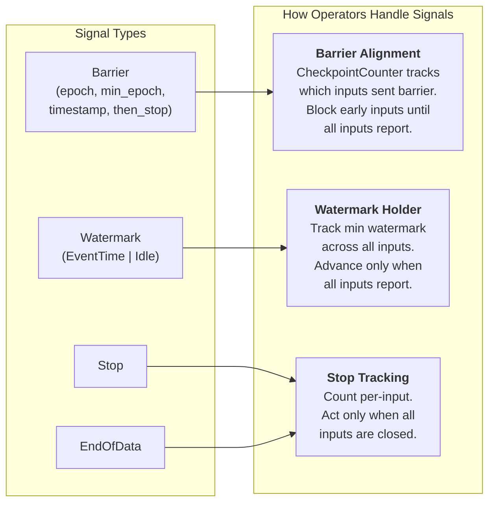

### Physical Graph Expansion

A logical node with parallelism=3 becomes 3 physical subtask instances:

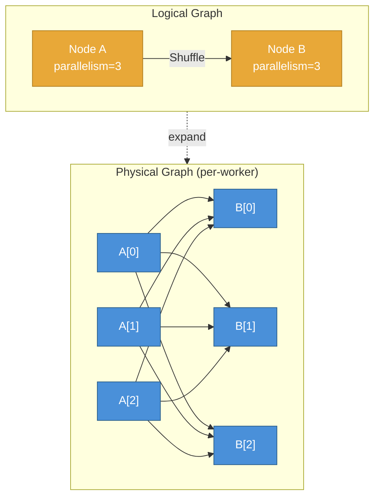

For **Forward** edges, the mapping is 1:1 (A[0]->B[0], A[1]->B[1], etc.) and requires equal parallelism. For **Shuffle** edges, every source subtask connects to every destination subtask (N x M full connectivity).

---

## 5. Checkpointing Flow

Arroyo implements Chandy-Lamport distributed snapshots with barrier alignment and optional two-phase commit for exactly-once sinks.

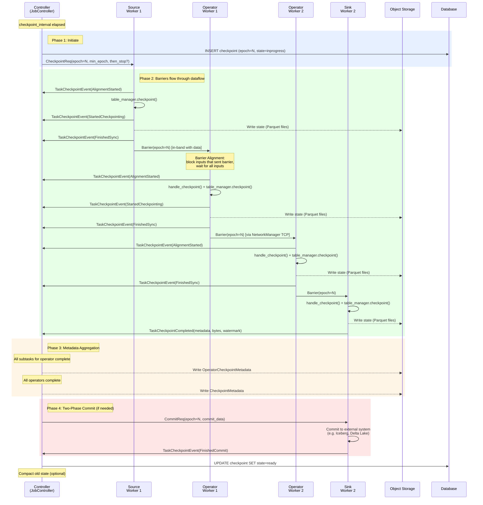

### Checkpoint Storage Layout

```
{checkpoint_url}/{job_id}/checkpoints/
    checkpoint-0000001/
        metadata                              # CheckpointMetadata (protobuf)
        operator-{id}/
            metadata                          # OperatorCheckpointMetadata
            table-{name}-000                  # Parquet state file (subtask 0)
            table-{name}-001                  # Parquet state file (subtask 1)
            table-{name}-000-compacted        # Compacted state file
    checkpoint-0000002/
        ...
```

### State Table Types

| Table Type | Use Case | State Structure |
|-----------|----------|-----------------|
| **GlobalKeyedTable** | Connector offsets, simple KV | `HashMap<K, V>` serialized via bincode |
| **ExpiringTimeKeyTable** | Window aggregations, joins | `RecordBatch` keyed by `(key, timestamp)` with TTL |
| **KeyTimeView** | Join state | Temporal key lookup |
| **UncachedKeyValueView** | On-demand lookups | Read from Parquet on demand |

### Recovery from Checkpoint

```mermaid
flowchart LR
    Fail["Task Failure<br/>or Worker Crash"]
    Recover["Recovering State<br/>(exponential backoff)"]
    Compile["Compiling State"]
    Schedule["Scheduling State<br/>(start new workers)"]
    Load["Workers load<br/>CheckpointMetadata<br/>from Object Storage"]
    Restore["TableManager restores<br/>each table from Parquet"]
    Resume["Resume processing<br/>from checkpoint epoch"]

    Fail --> Recover --> Compile --> Schedule --> Load --> Restore --> Resume

    classDef fail fill:#E06666,stroke:#A33D3D,color:#fff
    classDef recover fill:#E8A838,stroke:#B07D1E,color:#fff
    classDef ok fill:#50B86C,stroke:#2D7A3E,color:#fff

    class Fail fail
    class Recover,Compile,Schedule recover
    class Load,Restore,Resume ok
```

---

## 6. Worker Internal Architecture

The internal structure of a single Arroyo worker process.

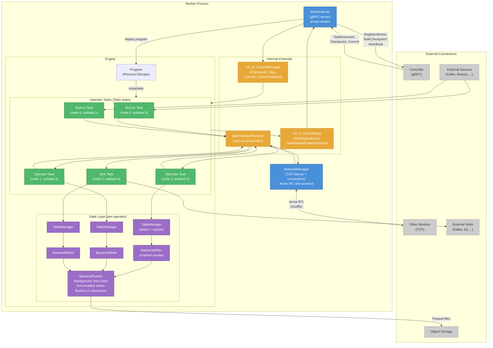

### Key Internal Components

| Component | Responsibility |
|-----------|---------------|
| **WorkerServer** | gRPC server handling controller commands; manages Engine lifecycle |
| **Engine** | Converts `LogicalProgram` -> physical graph, spawns operator tasks |
| **Program** | Holds the `DiGraph<SubtaskOrQueueNode, PhysicalGraphEdge>` |
| **NetworkManager** | TCP connections to other workers for shuffle data transfer |
| **TableManager** | Per-operator state API: typed access to GlobalKeyed, ExpiringTimeKey tables |
| **BackendWriter** | Channel sender for async state writes |
| **BackendFlusher** | Background task: accumulates state writes, flushes Parquet to storage on checkpoint |
| **InQReader** | `FuturesUnordered`-based stream combiner for multiple input queues |
| **ArrowCollector** | Output interface: handles repartitioning/shuffle for downstream operators |
| **CheckpointCounter** | Tracks barrier alignment across multiple input partitions |

### Task Execution Loop

Each non-source operator task runs this core loop:

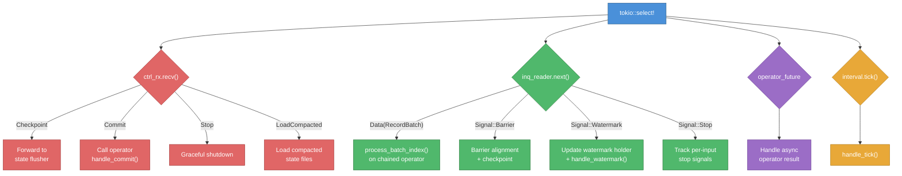

---

## Appendix: Available Operators

All operator types that can appear in a dataflow graph:

| Operator | Name in Graph | Description | State |
|----------|--------------|-------------|-------|
| **ConnectorSource** | `ConnectorSource` | 19 source connectors (Kafka, Kinesis, S3, etc.) | GlobalKeyed (offsets) |
| **ConnectorSink** | `ConnectorSink` | 19 sink connectors | GlobalKeyed (commit data) |
| **ArrowValue** | `ArrowValue` | Stateless DataFusion plan (filter, map, project) | None |
| **ArrowKey** | `ArrowKey` | Key extraction for shuffle | None |
| **Projection** | `Projection` | Column projection with physical expressions | None |
| **ExpressionWatermark** | `ExpressionWatermark` | Generate watermarks from event data | None |
| **TumblingWindowAggregate** | `TumblingWindowAggregate` | Fixed-size non-overlapping window aggregation | ExpiringTimeKey |
| **SlidingWindowAggregate** | `SlidingWindowAggregate` | Overlapping window aggregation | ExpiringTimeKey |
| **SessionWindowAggregate** | `SessionWindowAggregate` | Gap-based session window aggregation | ExpiringTimeKey |
| **UpdatingAggregate** | `UpdatingAggregate` | Incrementally updating aggregation (CDC output) | ExpiringTimeKey |
| **Join** | `Join` | Stateful streaming join with TTL expiration | 2x ExpiringTimeKey |
| **InstantJoin** | `InstantJoin` | Stateless instant join | None |
| **LookupJoin** | `LookupJoin` | External lookup join | None |
| **WindowFunction** | `WindowFunction` | SQL window functions (ROW_NUMBER, etc.) | ExpiringTimeKey |
| **AsyncUdf** | `AsyncUdf` | Asynchronous user-defined functions | None |

## Appendix: Supported Connectors

| Connector | Source | Sink | Lookup |
|-----------|--------|------|--------|
| Kafka | Yes | Yes | No |
| Confluent Cloud | Yes | Yes | No |
| Amazon Kinesis | Yes | Yes | No |
| RabbitMQ | Yes | No | No |
| Redis | Yes | Yes | Yes |
| MQTT | Yes | Yes | No |
| NATS | Yes | Yes | No |
| Fluvio | Yes | Yes | No |
| Server-Sent Events | Yes | No | No |
| WebSocket | Yes | Yes | No |
| Webhook | No | Yes | No |
| Polling HTTP | Yes | No | No |
| Filesystem (S3/GCS/Azure/Local) | Yes | Yes | No |
| Delta Lake | Yes | Yes | No |
| Apache Iceberg | No | Yes | No |
| Impulse (synthetic) | Yes | No | No |
| Nexmark (benchmark) | Yes | No | No |
| Preview (UI) | No | Yes | No |
| Blackhole (null) | No | Yes | No |
| stdout (console) | No | Yes | No |
